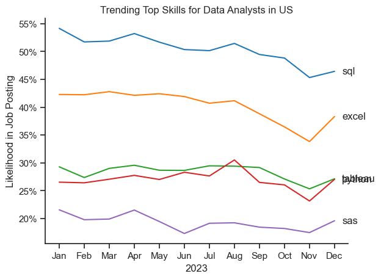

# The Analysis

## 1. What are the most demanded skills for the top 3 most popular jobs data roles?

### Steps taken:
1. Filtered positions by count to the top 3 most popular roles
2. Calculated the likelihood of each of the top few skills appearing in jobs postings requirements
3. Visualised them here

View my notebook here: [2_Skill_Demand.ipynb](3_Project\2_Skill_Demand.ipynb)
## Results:

### Insights:
1. Python is the most versatile skill, highly demanded across all 3 roles especially prominent in Data scientist (72%) and Data Engineer (68%) Role
2. SQL is the most requested skill for data Analysts and data Scientists 
3. Data Engineers requre more technical skills (AWS, Azure, Spark) compared to the other 2. Which makes sense.

## 2. How are the data skills trending throughout the year?

### Results:

### Insights
1. SQL remains the most consistently demanded skill throughout the year although it is decreasing
2. Excel experienced a significant increase in demand around September
3. Tableau and python are rather consistent throughout the year

